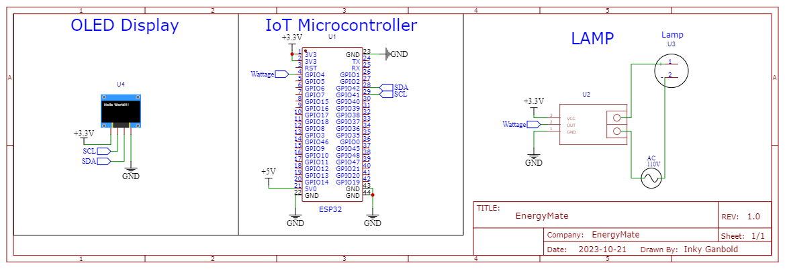

# ESP32 IoT Hackathon Project

Welcome to the ESP32 IoT project repository! This project combines the power of ESP32 microcontrollers, Proteus simulation, Arduino programming, Git version control, Postman for API testing, and DigitalOcean for cloud deployment. This was all done and made during the DA Hacks 2023 Hackathon from 10/20/2023 to 10/21/2023.


## Table of Contents

- [Introduction](#introduction)
- [Requirements](#requirements)
- [Installation](#installation)
- [Goals](#goals)
- [Usage](#usage)
- [Contributing](#contributing)
- [License](#license)

## Introduction

This project is aimed at creating a comprehensive IoT solution using the ESP32 microcontroller. The project includes simulations in Proteus, Arduino code for ESP32, Git for version control, Postman for API testing, and DigitalOcean for reliable cloud deployment.




## Requirements

Make sure you have the following tools and technology installed:

- [Arduino IDE](https://www.arduino.cc/en/software)
- [Proteus](https://www.labcenter.com/)
- [Git](https://git-scm.com/)
- [Postman](https://www.postman.com/)
- [DigitalOcean Account](https://www.digitalocean.com/)
- [ThingSpeak API](https://thingspeak.com/)
## Big Roadblocks we encountered and overcame.
### SQLite Unable to be connected with our DigitalOcean Server.
### Had to scale down the project several times.
We began planning our 
## Installation

1. Clone the repository:

   ```bash
   [git clone https://github.com/your-username/esp32-iot-project.git](https://github.com/connor-petri/EnergyMate)
   ```

2. Set up Arduino IDE for ESP32 development.

## Goals 

### Short-term Goal
Our current mission is to increase awareness about the financial aspects related to using electronic devices, giving people the knowledge and resources to not only save electricity but also protect their finances. By shedding light on the connection between energy consumption and financial impact, our goal is to promote responsible energy use and ensure a brighter future for everyone

### Long-Term Goal
Our grand, long-term vision is to make a significant contribution to the global battle against climate change. We're striving to achieve this by providing a groundbreaking and effective approach to conserving electricity. In the process, our aim is to be a part of the solution that helps safeguard the Earth's invaluable resources, promoting sustainability and ensuring a healthy environment for generations to come.

## Usage

1. Open the Arduino IDE and upload the provided ESP32 code to your microcontroller.

2. Simulate the project in Proteus to visualize the hardware interactions.

3. Connect to the ThingSpeak API, use it to visualize and graph our data and status of our microcontroller, alongside storing our actual data.
4. Use Postman to test the API endpoints.

5. Deploy the project to DigitalOcean for cloud-based IoT solutions.

## Contributing

Feel free to contribute to this project by creating issues or submitting pull requests. Your feedback and enhancements are highly appreciated.

## License

This project is licensed under the [MIT License](LICENSE).

Happy coding! 🚀
